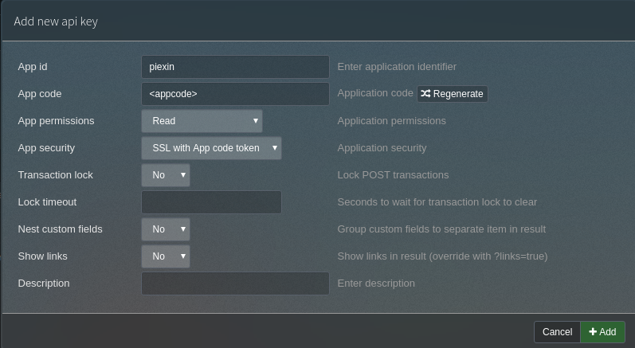
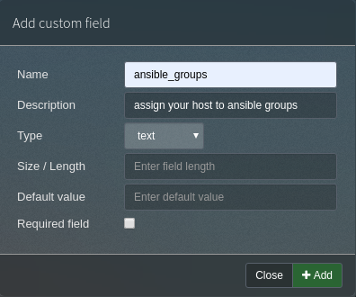

# piexin

[](https://travis-ci.com/aufbaubank/piexin)
[](https://codecov.io/gh/aufbaubank/piexin)


The **P**hp**I**pam **Ex**port **In**ventory for Ansible Inventory files.

## goals

This code can be used to export your phpipam data to an ansible inventory file.

- keep all data in one file
- one command, one task

## quickstart

### phpIPAM

* add an api account and get the api token for your app
* assign permissions
* set security to ssl with app token




* add a custom field to store your ansible groups



### run piexin

Either store your api key to the environment variable named `PHPIPAM_TOKEN`
or provide the token in the commandline

minimal command:
```
piexin -u https://phpipam.example.com --app piexin
```

# complete help
```
usage: piexin [-h] [-u url] [-t token] [-a app] [-c certificate] [-o output]
              [-V] [-v]

optional arguments:
  -h, --help            show this help message and exit
  -u url, --url url     url of phpipam server api, defaults to
                        http://localhost
  -t token, --token token
                        api token, can also be stored in environment variable
                        PHPIPAM_TOKEN
  -a app, --app app     phpipam api appname
  -c certificate, --cert certificate
                        ssl cert from server if server is not trusted
  -o output, --output output
                        file to print inventory to
  -V, --version         print version
  -v, --verbose
```
